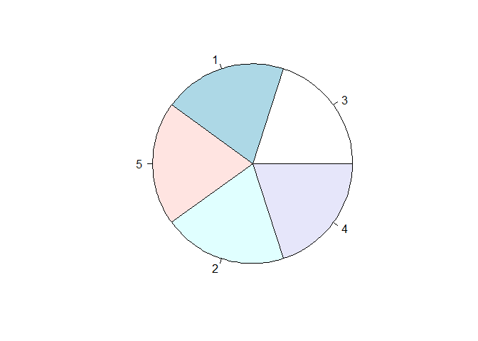
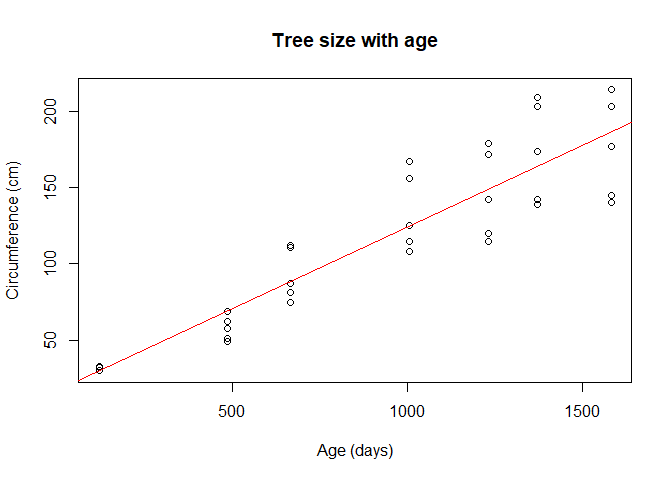

Exercise 2: R Markdown for Gapminder Exploration
================
Tracy Wang
September 2019

  - [Orange](#orange)
  - [Summary](#summary)
  - [Pie](#pie)
  - [Plot](#plot)

## Orange

Orange is a dataset about the growth of five orange trees. This is a
record of their trunk circumferences (in cm) at certain ages (in days).

The headers for the Orange dataset, as determined through the names()
function, are:

    ## [1] "Tree"          "age"           "circumference"

## Summary

Here is a summary of the Orange dataset using the summary() function:

    ##  Tree       age         circumference  
    ##  3:7   Min.   : 118.0   Min.   : 30.0  
    ##  1:7   1st Qu.: 484.0   1st Qu.: 65.5  
    ##  5:7   Median :1004.0   Median :115.0  
    ##  2:7   Mean   : 922.1   Mean   :115.9  
    ##  4:7   3rd Qu.:1372.0   3rd Qu.:161.5  
    ##        Max.   :1582.0   Max.   :214.0

## Pie

In the Orange dataset, each individual tree is labeled with an
identifying number, ranging from 1 to 5. The following pie chart
represents the relative number of times each tree is represented in the
dataset:

<!-- -->

Each tree has an equal number of data points.

## Plot

And here is a plot of tree circumference versus age:

<!-- -->

Obviously we cannot conclude this is a linear relationship. However, the
goal here was simply to add a trendline, and that was a success\!
