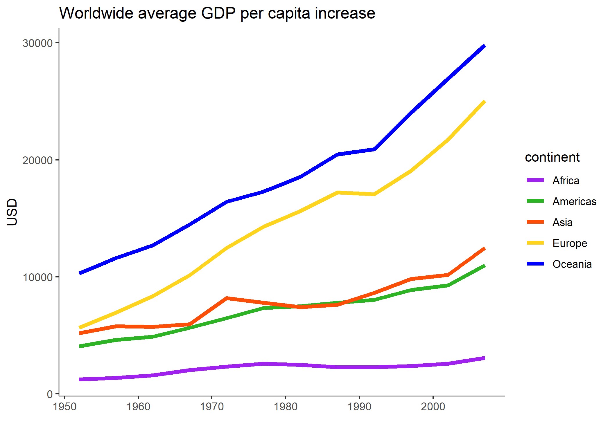
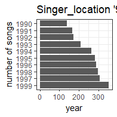

<style type="text/css">
.twoC {width: 100%}
.clearer {clear: both}
.twoC .table {max-width: 50%; float: right}
.twoC img {max-width: 50%; float: left}
</style>

<div class="clearer">

```{r startup}
suppressPackageStartupMessages(library(singer))
suppressPackageStartupMessages(library(tidyverse))
suppressPackageStartupMessages(library(DT))
suppressPackageStartupMessages(library(knitr))
```

## Exercise 1: Explain the value of the here::here package

*Task: In your own words, summarize the value of the here::here package in 250 words or fewer.*

The `here::here` package is useful for setting relative paths for the working directory of your project, especially when said project is shared among multiple users. 

- Not all users' local directories will have the same structure. If one were to set the working directory using `setwd()` then the working directory would have to be changed every time a different local computer was used. 
- Different operating systems use different notations to separate folders. For example, Mac computers do/it/this/way whereas Windows OS does\things\another\way. Whenever the project gets accessed from a different OS, the user would have to replace the slashes with backslashes, or vice versa. 
- This process is tedious and time-consuming to have to repeat all the time. And just imagine if you make a typo...

In a nutshell, `here::here` makes a project much more versatile for sharing. It makes navigating sub-directories easier, too.

- When retrieving files from another subdirectory, rather than having to backtrack to the parent directory and locate it from there, you can use `here()` to call directly on the sub-directory if it's in your root folder.
- It is possible to set a separate working directory within the project and still have `here()` work because project directories take precedence.


## Exercise 2: Factor management

I have chosen to use the **Singer** dataset.

*__Elaboration for the Singer data set__*

*Drop 0. Filter the singer_locations data to remove observations associated with the uncorrectly inputed year 0. Additionally, remove unused factor levels. Provide concrete information on the data before and after removing these rows and levels; address the number of rows and the levels of the affected factors.*

*Reorder the levels of year, artist_name or title. Use the forcats package to change the order of the factor levels, based on a principled summary of one of the quantitative variables. Consider experimenting with a summary statistic beyond the most basic choice of the median.*

### Drop factors/levels

First, let's look at `singer_locations` without modifications. The dataframe contains 10,100 entries, which apparently is too much for `datatable()` to handle as a client-side operation (!), so I won't be presenting it as a tibble.

```{r}
singer_all <- singer_locations %>% 
    mutate(year = as_factor(year))

singer_all$year %>% 
    str()
```

The above output shows us that `year` has now been converted to a factor class object, with 70 levels (different values) of year present in the dataframe. We can also see some instances of integers that these levels are stored as.

```{r}
singer_all

```

There are 10,100 rows of data in this dataframe.

Now let's filter out the entries with "0" under Year.

```{r}
singer_filter <- singer_all %>% 
    filter(year!=0)

singer_filter

singer_filter$year %>% 
    str()
```

Without using `droplevels()`, there are still 70 levels present, despite all instances of `year = 0` having been filtered out. However, the number of entries in the dataframe has decreased to 10,000.

```{r}
singer_drop <- singer_filter %>% 
    droplevels()

singer_drop

singer_drop$year %>% 
    str()
```

Now that the level 0 is dropped, `year` has 69 levels total. The number of entries remains the same as in the previous step.

### Re-order levels (by year)

To simplify our plot, let's categorize years into decades.

```{r}
(singer_fct <- singer_locations %>% 
    filter(year != 0) %>% 
    mutate(decade = cut(year, breaks = c(1919, 1929, 1939, 
                                         1949, 1959, 1969, 
                                         1979, 1989, 1999, 
                                         2009, 2019),
                               labels = c("1920s", "1930s", 
                                          "1940s", "1950s", 
                                          "1960s", "1970s", 
                                          "1980s", "1990s", 
                                          "2000s", "2010s"))))

singer_fct$decade %>% 
    nlevels()
```

There are 10 levels in the `decade` factor. 


#### Plotting

The following is a box plot of song durations by decade, in chronological order. We can see that the durations of songs varies greatly, with some of the longest songs being around 2000 seconds. The plot on the right organizes the decades in order of greatest to smallest maximum duration (per decade).

```{r boxplots, eval=FALSE}
singer_fct %>%     
    ggplot() + 
    geom_boxplot(aes(x=decade, y=duration)) +
    theme_bw() +
    ylab("duration (s)") + 
    ggtitle("Singer_location songs")

singer_fct %>%     
    ggplot() + 
    geom_boxplot(aes(x=fct_rev(fct_reorder(decade, duration, max)), y=duration)) +
    theme_bw() + 
    ylab("duration (s)") + xlab("decade") +
    ggtitle("Maximum duration of singer_location songs")
```

</div>

<div class = "twoC">

```{r boxplot_run, echo=FALSE}
singer_fct %>%     
    ggplot() + 
    geom_boxplot(aes(x=decade, y=duration)) +
    theme_bw() +
    ylab("duration (s)") + 
    ggtitle("Singer_location songs")

singer_fct %>%     
    ggplot() + 
    geom_boxplot(aes(x=fct_rev(fct_reorder(decade, duration, max)), y=duration)) +
    theme_bw() +
    ylab("duration (s)") + xlab("decade") +
    ggtitle("Maximum duration of singer_location songs")
```

</div>

Here is a table and two bar graphs of the number of songs listed for each decade. The second graph has been reordered by number of entries per decade.

```{r}
singer_fct %>% 
    group_by(decade) %>% 
    count() %>% 
    kable()
```

```{r bargraphs, eval=FALSE}
singer_fct %>% 
    ggplot() +
    geom_bar(aes(decade)) + 
    coord_flip() +
    theme_bw() + 
    xlab("decade") + ylab("number of entries") +
    ggtitle("Singer_location song entries")

singer_fct %>% 
    ggplot() +
    geom_bar(aes(fct_infreq(decade))) +
    coord_flip() +
    theme_bw() + theme(axis.text.x = element_text(size = 8)) +
    xlab("decade") + ylab("number of entries") +
    ggtitle("Singer_location song entries")
```

<div class = "twoC">

```{r bargraphs_run, echo=FALSE}
singer_fct %>% 
    ggplot() +
    geom_bar(aes(decade)) + 
    coord_flip() +
    theme_bw() + 
    xlab("decade") + ylab("number of entries") +
    ggtitle("Singer_location song entries")

singer_fct %>% 
    ggplot() +
    geom_bar(aes(fct_infreq(decade))) +
    coord_flip() +
    theme_bw() + 
    xlab("decade") + ylab("number of entries") +
    ggtitle("Singer_location song entries")
```

</div>

Building off the above bar graphs, let's order the song count by maximum duration per decade, starting with the longest at the top. At the same time, we can confirm our observations of the graph with the tabulated version of the data.

```{r barandtable, eval=FALSE}
singer_fct %>% 
    ggplot() +
    geom_bar(aes(fct_reorder(decade, duration, max))) +
    coord_flip() +
    theme_bw() +
    xlab("decade") + ylab("number of entries") +
    ggtitle("Singer_locations song entries (descending order of maximum duration)")
    

singer_fct %>% 
    group_by(decade) %>% 
    summarize(longest=max(duration)) %>% 
    arrange(desc(longest)) %>% 
    kable()

```

<div class="twoC">

```{r barandtable_run, echo=FALSE, fig.height=5}
singer_fct %>% 
    group_by(decade) %>% 
    summarize(longest=max(duration)) %>% 
    arrange(desc(longest)) %>% 
    kable()

singer_fct %>% 
    ggplot() +
    geom_bar(aes(fct_reorder(decade, duration, max))) +
    coord_flip() +
    theme_bw() +
    xlab("decade") + ylab("number of entries") +
    ggtitle("Singer_locations song entries (descending order of maximum duration)")
```

</div>


## Exercise 3: File input/output (I/O)

*Task: Experiment with at least one of:*

- *write_csv()/read_csv() (and/or TSV friends),*
- *saveRDS()/readRDS(),*
- *dput()/dget().*

### write_csv()/read_csv()

Let's write our factored singer_locations dataframe from Exercise 2 to file. We'll keep only songs from the 1990s to trim down the dataframe size a little.

```{r}
library(here)

# set_here() was previously called to create a .here file in the HW05 folder.

dr_here()

(singer_out <- singer_fct %>% 
    filter(decade == "1990s"))

write_csv(singer_out, here::here("singer_fct.csv"))

```

```{r load_csv, warning=FALSE}
(singer_load <- read_csv(here::here("singer_fct.csv")))

```

We can see that our `decade` column is parsed as a character class instead of factor.

Now that we only have 10 years' worth of songs to work with, let's arrange them in ascending order of frequency from the top.

```{r}
(E3_plot <- singer_load %>% 
    mutate(year=as_factor(year)) %>% 
    ggplot() + geom_bar(aes(fct_infreq(year))) +
    coord_flip() +
    theme_bw() + 
    xlab("number of songs") + ylab("year") +
    ggtitle("Singer_location '90s songs")) 
```

### dput()/dget()

I will try the same exercise with `dput()`/`dget()`.

```{r}
dput(singer_out, file = here::here("singer_fct_d.csv"))
```

The file has been successfully written, but the format of the table is different than `write_csv()`'s output, which I confirmed by opening the .csv files using Excel. Trying to use `read_csv()` on the `dput()` output caused a myriad of parsing errors.

```{r}
(singer_get <- dget(here::here("singer_fct_d.csv"), keep.source = TRUE))
```

In this case, the factor class of `decade` actually made it through the wringer. When the file is retrieved and parsed, it's still a factor. 

For my last attempt at factor play, I extracted the first character from the `artist_name` column. The box plot describes the spread of artist familiarity for artists whose names begin with a certain letter (or number), in order from greatest maximum familiarity to least.

```{r }
singer_first <- singer_get %>% 
    drop_na() %>% 
    group_by(firstletter = as_factor(substr(artist_name, 1, 1)))

singer_first %>% 
    count() %>% 
    datatable()
```

```{r artists, eval=FALSE}
singer_first %>% 
    ggplot() + geom_boxplot(aes(x=firstletter, y=artist_familiarity)) +
    theme_bw() +
    xlab("first letter of artist name") + ylab("artist familiarity") +
    ggtitle("Singer_locations '90s song artists")

singer_first %>% 
    ggplot() + geom_boxplot(aes(
        x=fct_rev(fct_reorder(firstletter, artist_familiarity, max)), 
        y=artist_familiarity)) +
    theme_bw() +
    xlab("first letter of artist name") + ylab("artist familiarity") +
    ggtitle("Singer_locations '90s song artists (reordered)")
```

<div class = "twoC">

```{r artists_run, echo=FALSE}
singer_first %>% 
    ggplot() + geom_boxplot(aes(x=firstletter, y=artist_familiarity)) +
    theme_bw() +
    xlab("first letter of artist name") + ylab("artist familiarity") +
    ggtitle("Singer_locations '90s song artists")

singer_first %>% 
    ggplot() + geom_boxplot(aes(
        x=fct_rev(fct_reorder(firstletter, artist_familiarity, max)), 
        y=artist_familiarity)) +
    theme_bw() +
    xlab("first letter of artist name") + ylab("artist familiarity") +
    ggtitle("Singer_locations '90s song artists (reordered)")
```

</div>


## Exercise 4: Visualization design

*Task: Create a side-by-side plot and juxtapose your first attempt (show the original figure as-is) with a revised attempt after some time spent working on it and implementing principles of effective plotting principles. Comment and reflect on the differences.*

Here is a figure from my Assignment 3, showing average GDP per capita for each continent.

```{r}
library(gapminder)

gapminder %>% 
  group_by(continent, year) %>% 
  summarize(avggdp=mean(gdpPercap)) %>% 
  ggplot(aes(x=year, y=avggdp, color=continent)) + geom_line(size=1.5) + theme_bw() +
  ggtitle("Average GDP per capita, 1952-2007", subtitle="weighted by country") +
  ylab("average GDP per capita")
```

Changes to implement:
- shorten title and remove subtitle
- change Y-axis label
- remove background gridlines
- remove border
- change color palette for more contrast

```{r}
gapminder %>% 
    group_by(continent, year) %>% 
    summarize(avggdp=mean(gdpPercap)) %>% 
    ggplot(aes(x=year, y=avggdp, color=continent)) + 
    geom_line(size=1.5) + 
    theme_bw() +
    theme(panel.border = element_blank(), 
          panel.grid.major = element_blank(), 
          panel.grid.minor = element_blank(),
          axis.line = element_line(color = "grey")) +
    scale_color_manual(values = c("purple", "#2DB425", "#FC4E07", "#FED51C", "blue")) +
    xlab("") + ylab("USD") +
    ggtitle("Worldwide average GDP per capita increase")

```

Side by side comparison:

<div class = "twoC">

```{r sidebyside, echo=FALSE}
gapminder %>% 
  group_by(continent, year) %>% 
  summarize(avggdp=mean(gdpPercap)) %>% 
  ggplot(aes(x=year, y=avggdp, color=continent)) + geom_line(size=1.5) + theme_bw() +
  ggtitle("Average GDP per capita, 1952-2007", subtitle="weighted by country") +
  ylab("average GDP per capita")

gapminder %>% 
    group_by(continent, year) %>% 
    summarize(avggdp=mean(gdpPercap)) %>% 
    ggplot(aes(x=year, y=avggdp, color=continent)) + 
    geom_line(size=1.5) + 
    theme_bw() +
    theme(panel.border = element_blank(), 
          panel.grid.major = element_blank(), 
          panel.grid.minor = element_blank(),
          axis.line = element_line(color = "grey")) +
    scale_color_manual(values = c("purple", "#2DB425", "#FC4E07", "#FED51C", "blue")) +
    xlab("") + ylab("USD") +
    ggtitle("Worldwide average GDP per capita increase")
```

</div>

The major difference of the new edition is that the line colors are easier to distinguish. There's less visual clutter. I removed as many of the redundancies as I could, such as stating the years over which the data spanned in the title, and even the x-axis label. For units on the y-axis, I took a guess that the GDP per capita values were in USD, but essentially whatever currency the numbers are in should go there.

The new graph looks a lot more minimalistic, which helps get its point across much more efficiently.


## Exercise 5: Writing figures to file

*Task: Use ggsave() to explicitly save a plot to file. Include the exported plot as part of your repository and assignment.*

*Then, use `` to load and embed that file into your report.* 
    
By default, `ggsave()` renders the last plot item to file. When this code was first written, Exercise 4 had not been completed yet, so three guesses why the file name is "firstletter_boxplot"...
    
```{r}
ggsave("firstletter_boxplot.png")
```

This will save to your root directory as declared by `here::here()`. Now I can embed the image like so...



Explicitly declaring the plot to save to file is important if you're going to backtrack and add more diagrams at any point.

Here's another one, with some parameters changed this time. I assigned a variable back in Exercise 3 that I will now use:

```{r}
ggsave("90s_bargraph.png", plot = E3_plot, dpi = 100, units = "mm", width = 50, height = 50)
```
    

    
The text doesn't change size with the plot; that needs to be changed explicitly when creating the plot.

<!--- Old code, rejected for tedious repetition
```{r}
singer_fct <- singer_locations %>% 
    filter(year != 0) %>% 
    mutate(decade = factor(case_when(year < 1920 ~ "1910s",
                                     year < 1930 ~ "1920s",
                                     year < 1940 ~ "1930s",
                                     year < 1950 ~ "1940s",
                                     year < 1960 ~ "1950s",
                                     year < 1970 ~ "1960s",
                                     year < 1980 ~ "1970s",
                                     year < 1990 ~ "1980s",
                                     year < 2000 ~ "1990s",
                                     year < 2010 ~ "2000s",
                                     TRUE ~ "2010s"), 
                           levels = c("1910s", "1920s", 
                                      "1930s", "1940s", 
                                      "1950s", "1960s", 
                                      "1970s", "1980s", 
                                      "1990s", "2000s", 
                                      "2010s")))

```
-->
