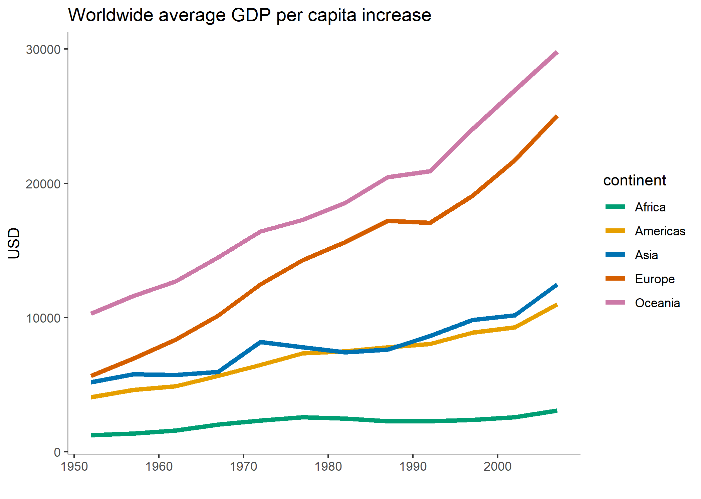

## Exercise 1: Explain the value of the here::here package

*Task: In your own words, summarize the value of the here::here package in 250 words or fewer.*

The `here::here` package is useful for setting relative paths for the working directory of your project, especially when said project is shared among multiple users. 

- Not all users' local directories will have the same structure. If one were to set the working directory using `setwd()` then the working directory would have to be changed every time a different local computer was used. 
- Different operating systems use different notations to separate folders. For example, Mac computers do/it/this/way whereas Windows OS does\things\another\way. Whenever the project gets accessed from a different OS, the user would have to replace the slashes with backslashes, or vice versa. 
- This process is tedious and time-consuming to have to repeat all the time. And just imagine if you make a typo...

In a nutshell, `here::here` makes a project much more versatile for sharing. It makes navigating sub-directories easier, too.

- When retrieving files from another subdirectory, rather than having to backtrack to the parent directory and locate it from there, you can use `here()` to call directly on the sub-directory if it's in your root folder.
- It is possible to set a separate working directory within the project and still have `here()` work because project directories take precedence.

```{r}
library(singer)
library(tidyverse)
library(DT)
library(knitr)
```


## Exercise 2: Factor management

I have chosen to use the **Singer** dataset.

*Task: Choose one dataset (of your choice) and a variable to explore. After ensuring the variable(s) you’re exploring are indeed factors, you should:*

- *Drop factor / levels;*
- *Reorder levels based on knowledge from data.*

*Explore the effects of re-leveling a factor in a tibble by:*

- *comparing the results of arrange on the original and re-leveled factor.*
- *Plotting a figure of before/after re-leveling the factor (make sure to assign the factor to an aesthetic of your choosing).*

*These explorations should involve the data, the factor levels, and at least two figures (before and after).*

*__Elaboration for the Singer data set__*

*Drop 0. Filter the singer_locations data to remove observations associated with the uncorrectly inputed year 0. Additionally, remove unused factor levels. Provide concrete information on the data before and after removing these rows and levels; address the number of rows and the levels of the affected factors.*

*Reorder the levels of year, artist_name or title. Use the forcats package to change the order of the factor levels, based on a principled summary of one of the quantitative variables. Consider experimenting with a summary statistic beyond the most basic choice of the median.*

### Drop factors/levels

First, let's look at `singer_locations` without modifications. The dataframe contains 10,100 entries, which apparently is too much for `datatable()` to handle as a client-side operation (!), so I won't be presenting it as a tibble.

```{r}
singer_all <- singer_locations %>% 
    mutate(year = as_factor(year))

singer_all$year %>% 
    str()
```

The above output shows us that `year` has now been converted to a factor class object, with 70 levels (different values) of year present in the dataframe. We can also see some instances of integers that these levels are stored as.

```{r}
singer_all

```

There are 10,100 rows of data in this dataframe.

Now let's filter out those `year = 0` entries.

```{r}
singer_filter <- singer_all %>% 
    filter(year!=0)

singer_filter

singer_filter$year %>% 
    str()
```

Without using `droplevels()`, there are still 70 levels present, despite all instances of `year = 0` having been filtered out. However, the number of entries in the dataframe has decreased to 10,000.

```{r}
singer_drop <- singer_filter %>% 
    droplevels()

singer_drop

singer_drop$year %>% 
    str()
```

Now that the level 0 is dropped, `year` has 69 levels total. The number of entries remains the same as in the previous step.

### Re-order levels (by year)

To simplify our plot, let's categorize years into decades.

```{r}
(singer_fct <- singer_locations %>% 
    filter(year != 0) %>% 
    mutate(decade = cut(year, breaks = c(1919, 1929, 1939, 
                                         1949, 1959, 1969, 
                                         1979, 1989, 1999, 
                                         2009, 2019),
                               labels = c("1920s", "1930s", 
                                          "1940s", "1950s", 
                                          "1960s", "1970s", 
                                          "1980s", "1990s", 
                                          "2000s", "2010s"))))

singer_fct$decade %>% 
    nlevels()

```

There are 10 levels in the `decade` factor. 

#### Plotting

The following is a box plot of song durations by decade, in chronological order.

```{r}
singer_fct %>%     
    ggplot() + 
    geom_boxplot(aes(x=decade, y=duration))
```

We can see that the durations of songs varies greatly, with some of the longest songs being around 2000 seconds.

```{r}
singer_fct %>%     
    ggplot() + 
    geom_boxplot(aes(x=fct_rev(fct_reorder(decade, duration, max)), y=duration))
```


Here is a bar graph of the number of songs listed for each decade:

```{r}
singer_fct %>% 
    ggplot() +
    geom_bar(aes(decade)) + 
    scale_x_discrete(drop=FALSE) +
    scale_y_log10() 

singer_fct %>% 
    count(decade) %>% 
    kable()
```

By default, the levels happen to be arranged in chronological order. 

Note that a single instance of 1930s music does exist in this dataframe, but ggplot got upset about my attempt to use `expand_limits()` to force the y-axis to start at 0. 

The next graph shows the same info, but arranged in order of most to fewest songs listed per decade.

```{r}
singer_fct %>% 
    ggplot() +
    geom_bar(aes(fct_infreq(decade))) +
    scale_y_log10()
```

A linear y-axis scale will be used for subsequent plots.

Let's order the song count by maximum duration per decade, starting with the longest. At the same time, we can confirm our observations of the graph with the tabulated version of the data.

```{r}

singer_fct %>% 
    ggplot() +
    geom_bar(aes(decade))

singer_fct %>% 
    ggplot() +
    geom_bar(aes(fct_rev(fct_reorder(decade, duration, max))))

singer_fct %>% 
    group_by(decade) %>% 
    summarize(longest=max(duration)) %>% 
    arrange(desc(longest)) %>% 
    kable()
```


## Exercise 3: File input/output (I/O)

*Task: Experiment with at least one of:*

- *write_csv()/read_csv() (and/or TSV friends),*
- *saveRDS()/readRDS(),*
- *dput()/dget().*

### write_csv()/read_csv()

Let's write our factored singer_locations dataframe from Exercise 2 to file. We'll keep only songs from the 1990s to trim down the dataframe size a little.

```{r}
library(here)

# set_here() was previously called to create a .here file in the HW05 folder.

dr_here()

(singer_out <- singer_fct %>% 
    filter(decade == "1990s"))

write_csv(singer_out, here::here("singer_fct.csv"))

```

```{r load_csv, warning=FALSE}
(singer_load <- read_csv(here::here("singer_fct.csv")))

```

We can see that our `decade` column is parsed as a character class instead of factor.

Now that we only have 10 years' worth of songs to work with, let's arrange them in ascending order of frequency from top to bottom.

```{r}
(E3_plot <- singer_load %>% 
    mutate(year=as_factor(year)) %>% 
    ggplot() + geom_bar(aes(fct_infreq(year))) +
    coord_flip())
```

### dput()/dget()

I will try the same exercise with `dput()`/`dget()`.

```{r}
dput(singer_out, file = here::here("singer_fct_d.csv"),
     control = c("keepNA", "keepInteger", "niceNames", "showAttributes"))
```

The file has been successfully written, but the format of the table is different than `write_csv()`'s output, which I confirmed by opening the .csv files using Excel. Trying to use `read_csv()` on the `dput()` output caused a myriad of parsing errors.

```{r}
(singer_get <- dget(here::here("singer_fct_d.csv"), keep.source = TRUE))
```

In this case, the factor class of `decade` actually made it through the wringer. When the file is retrieved and parsed, it's still a factor. 

Enough messing around with `decade`--how about using another factor? 

In the code below, I extracted the first character from the `artist_name` column. The box plot describes the spread of artist familiarity for artists whose names begin with a certain letter (or number), in order from greatest maximum familiarity to least.

```{r}
singer_first <- singer_get %>% 
    drop_na() %>% 
    group_by(firstletter = as_factor(substr(artist_name, 1, 1)))

singer_first %>% 
    count() %>% 
    datatable()

singer_first %>% 
    ggplot() + geom_boxplot(aes(
        x=fct_rev(fct_reorder(firstletter, artist_familiarity, max)), 
        y=artist_familiarity))
```


## Exercise 4: Visualization design (20%)

*Go back through your previous assignments and class participation activities and find figures you created prior to the last week of the course. Recreate at least one figure in light of something you learned in the recent class meetings about visualization design and color.*

*Task: Create a side-by-side plot and juxtapose your first attempt (show the original figure as-is) with a revised attempt after some time spent working on it and implementing principles of effective plotting principles. Comment and reflect on the differences.*


## Exercise 5: Writing figures to file

*Task: Use ggsave() to explicitly save a plot to file. Include the exported plot as part of your repository and assignment.*

*Then, use `` to load and embed that file into your report.* 
    
By default, `ggsave()` renders the last plot item to file. At the time of this writing, that would be the artist familiarity box plot in Exercise 3. The image is named "firstletter_boxplot" for this reason. However, once I complete Exercise 4, I expect that this image will contain something other than the aforementioned box plot...
    
```{r}
ggsave("firstletter_boxplot.png")
```

Having saved the image, I can then embed it like so...




And now, writing this after completing Exercise 4, ...

Here's another one, with some parameters changed this time.

```{r}
ggsave("90s_bargraph.png", plot = E3_plot, dpi = 100, units = "mm", width = 50, height = 30)
```
    

    
The text is huge because it needs to be changed for the plot object itself (i.e. `ggsave()` only shrunk the plot area itself). 

<!--- Old code, rejected for tedious repetition
```{r}
singer_fct <- singer_locations %>% 
    filter(year != 0) %>% 
    mutate(decade = factor(case_when(year < 1920 ~ "1910s",
                                     year < 1930 ~ "1920s",
                                     year < 1940 ~ "1930s",
                                     year < 1950 ~ "1940s",
                                     year < 1960 ~ "1950s",
                                     year < 1970 ~ "1960s",
                                     year < 1980 ~ "1970s",
                                     year < 1990 ~ "1980s",
                                     year < 2000 ~ "1990s",
                                     year < 2010 ~ "2000s",
                                     TRUE ~ "2010s"), 
                           levels = c("1910s", "1920s", 
                                      "1930s", "1940s", 
                                      "1950s", "1960s", 
                                      "1970s", "1980s", 
                                      "1990s", "2000s", 
                                      "2010s")))

```
-->
